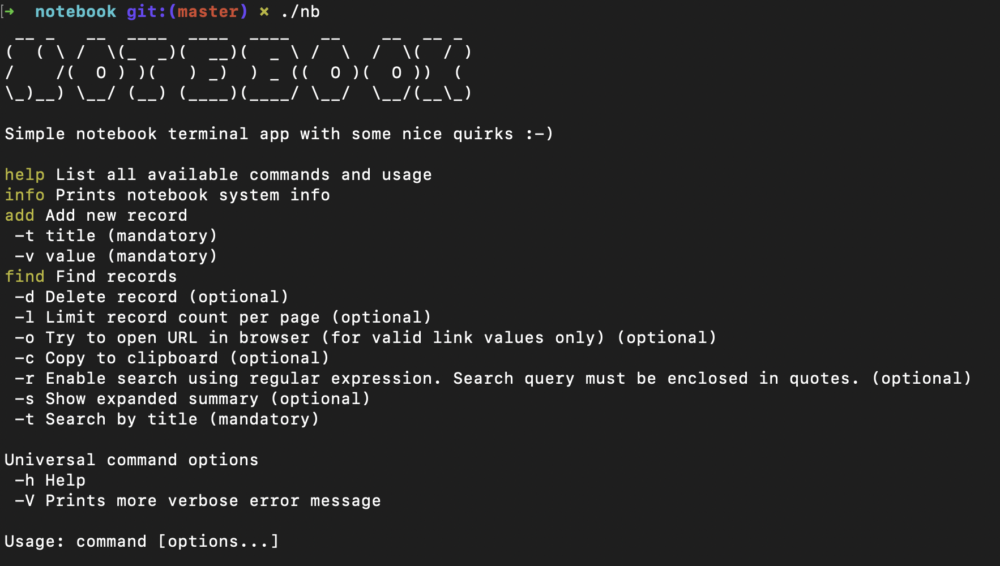
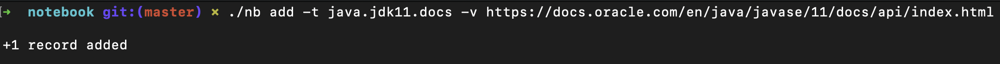
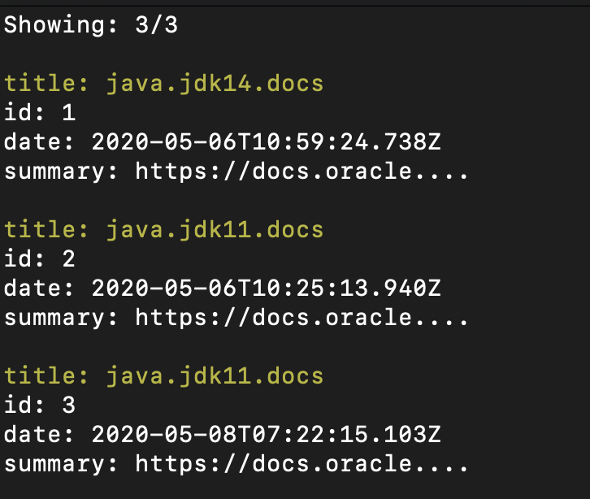
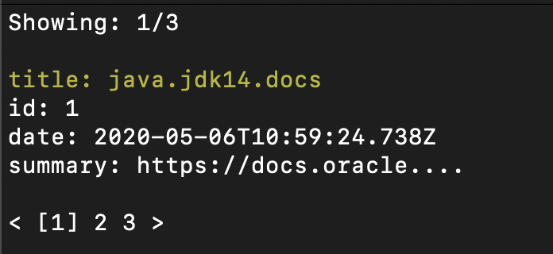
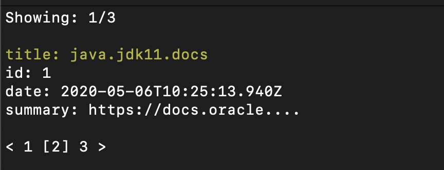

# Notebook

## Why?
If you spend most of the time using terminal this might come in handy. 
This simple terminal application allows you to store chunks of text you often use on your local machine.
You can store code snippets, links etc. and then have it in clipboard in a blink of an eye without copying marked text with mouse or keyboard.
If you stored a link you can immediately open it in browser.

For me, it was about combining what is useful to me and learning about GraalVM native images. 
As an end product, you get native binary executable which is currently useful only on MacOSX because internally it uses some terminal commands(e.g. **pbcopy**) available only on MacOSX.
It is actually not a lot of work to make it work on Windows or Linux and I will add that support as soon as I can.

Goals I wanted to achieve with this project:
* Build simple and useful CLI tool which does not require Java to be installed on the machine
* Use [RandomAccessFile](https://docs.oracle.com/en/java/javase/11/docs/api/java.base/java/io/RandomAccessFile.html) as a database
* Learn how to create native image with GraalVM
* Create simple inverted index



## Features
* Store some text under some title
* Delete record
* Find records by title
* Add record value to clipboard
* Open record value in browser if value is a valid URL
* Paginated results

## What Notebook is not?
It is not a database. You can still store a lot of data and search fast enough but it will not be very useful if you plan to store gigabytes.
After all, it is a notebook ;-)

## Usage
Just download the latest **nb** binary executable from [releases](https://github.com/vsmid/notebook/releases) page.

#### Add new record
```bash
./nb add -t java.jdk11.docs -v https://docs.oracle.com/en/java/javase/11/docs/api/index.html 
```

*You can also add multiline text value by enclosing it in quotes.*
#### Find record
```bash
./nb find -t java
./nb find -t docs
./nb find -t jdk11
# using regex
./nb find -r -t "java.*"
```

#### Copy record to clipboard
```bash
# if it yields single result -c flag does not require id
./nb find -t java -c
# if it yields more results -c flag needs an id
./nb find -t java -c 1
```
#### Open record in browser
```bash
# if it yields single result -o flag does not require id
./nb find -t java -o
# if it yields more results -o flag needs an id
./nb find -t java -o 1
```
#### Delete record
```bash
# if it yields single result -d flag does not require id
./nb find -t java -d
# if it yields more results -d flag needs an id
./nb find -t java -d 1
```
#### Show extended summary
```bash
# if it yields single result -s flag does not require id
./nb find -t java -s
# if it yields more results -s flag needs an id
./nb find -t java -s 1
```
#### Limit results per page
```bash
./nb find -t java -l 1
```

#### Select page
```bash
./nb find -t java -l 1 -p 2
```

*Once you have selected page, copy to clipboard, delete, open in browser and show extended summary all work the same as without using page*
```bash
# if it yields single result -o flag does not require id
./nb find -t java -l 1 -p 2 -o
# if it yields more results -o flag needs an id
./nb find -t java -l 1 -p 2 -o 1
# etc.
```
